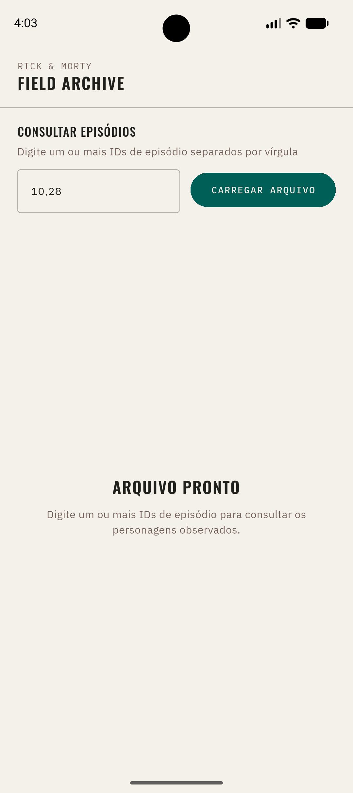
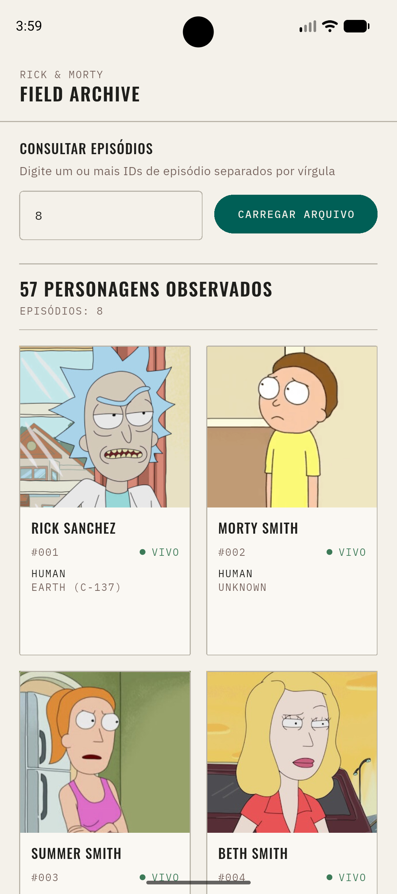
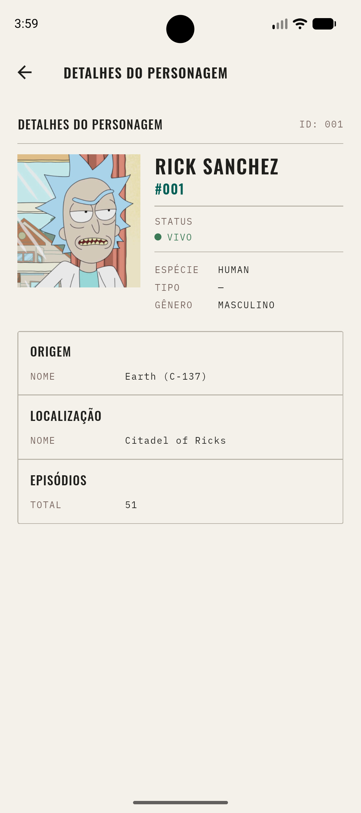

# Rick & Morty — Field Archive (mobile)

Porta mobile do [rick-morty-frontend](../rick-morty-frontend), consumindo o
[rick-morty-backend](../rick-morty-backend). O usuário informa IDs de episódio →
grid dos personagens presentes → tela de detalhe.

| Estado inicial | Resultados | Detalhe |
|:-:|:-:|:-:|
|  |  |  |

## Rodando

```bash
flutter pub get
dart run build_runner build      # *.g.dart / *.freezed.dart
flutter gen-l10n                 # lib/l10n/generated/
flutter run                      # aponta para o backend publicado (Vercel), sem setup local
```

> **Windows:** habilite o *Developer Mode* (`start ms-settings:developers`) — o Flutter
> precisa de symlink para plugins.

Para um **backend local**, use o script (sem argumento = remoto):

```bash
scripts/run.ps1 emulator    # http://10.0.2.2:3000        (backend na máquina host)
scripts/run.ps1 device      # http://<IP-da-máquina>:3000  (celular na mesma rede Wi-Fi)
scripts/run.sh  emulator    # equivalente em bash
```

| Alvo | `API_BASE_URL` | Config |
|---|---|---|
| _(default)_ `remote` | backend na Vercel | `config/prod.json` |
| `emulator` | `http://10.0.2.2:3000` | `config/dev.json` |
| `device` | `http://<lan-ip>:3000` | `config/local-device.json` (copie de `.example`) |

No VS Code, **F5** roda a config remota; as variantes locais estão no dropdown de
*Run and Debug*.

## Stack

Flutter / Dart 3 · **Riverpod** (code-gen) — estado + DI · **go_router** · **Dio** ·
**freezed** + **json_serializable** · **cached_network_image** · i18n via `gen-l10n`
(pt/en) · lint `very_good_analysis` · testes com `mocktail` + `flutter_test`.

## Arquitetura

Feature-first + Clean pragmática. Uma feature: `field_archive` (episódio é *input*,
não recurso navegável — o backend não lista episódios).

```
lib/
  app/            RickMortyApp (MaterialApp.router + tema + i18n)
  bootstrap.dart  composition root (runZonedGuarded + ProviderScope)
  core/
    env/          AppEnv — API_BASE_URL/APP_ENV via --dart-define, valida a URL
    network/      Dio + interceptor, ApiException, cache manager de imagem
    error/        sealed Failure (InvalidInput / NotFound / Connection / Unknown)
    router/       go_router: '/' e '/character/:id' — paths em Routes
    theme/        tokens do "Field Archive" → ThemeData + ArchiveColors (ThemeExtension)
  features/field_archive/
    data/         CharacterDto + mapper, RemoteDataSource (Dio), RepositoryImpl
    domain/       Character (freezed) + enums, EpisodeQuery (value object),
                  CharacterRepository, GetCharactersByEpisodes (use case)
    presentation/ controllers (AsyncNotifier), pages, widgets
```

Fluxo de erro:

```
DioException → ApiException (data source) → Failure sealed (repository)
            → AsyncValue.error → UI faz switch exaustivo nas copies
```

### Decisões

- **DTO ≠ entidade** — a API é *stringly-typed*; o mapper converte `status`/`gender`
  em enums. A entidade só carrega o que as telas usam.
- **Sem `Either`/`fpdart`** — `AsyncNotifier` já modela loading/data/error; empilhar
  `Either` sobre `AsyncValue` seria wrapper duplo.
- **`EpisodeQuery`** (value object) é dono da validação dos IDs (regex, trim, dedupe) —
  porta de `episodeIds.ts`, no domínio, não na UI.
- **Sem use case de passagem** — a tela de detalhe chama o repositório direto;
  `GetCharactersByEpisodes` existe porque constrói/valida o `EpisodeQuery`.
- **Paginação** client-side, scroll lazy (`GridView.builder`) — sem botões numerados.
- **Tema** — tokens do `@theme` do frontend portados; cores fora do `ColorScheme` num
  `ThemeExtension` (`context.archiveColors`).
- **Riverpod** code-gen (`@riverpod`), `AsyncNotifier` para estado de tela, `Ref`
  como DI. Sem provider global mutável.

## Testes

**74 testes**, cobertura de linha **~89%** (`domain/` e `data/` perto de 100%).

```bash
flutter test
flutter test --coverage
flutter test --tags golden [--update-goldens]
```

- **unit** — `EpisodeQuery`, `Failure`/`ApiException`, DTO→entidade, `AppEnv`
- **repository / data source** — `mocktail` isolando Dio e o data source
- **controller** — `ProviderContainer` + overrides
- **widget** — archive (vazio / loading / resultados / erro / input inválido),
  detalhe (preloaded / fetch por id / 404), componentes
- **golden** — `EntityCard`, `StatusIndicator`, `CharacterDetailView`, com as fontes
  reais via `test/flutter_test_config.dart` (baselines gerados no Windows)

CI ([.github/workflows/ci.yaml](.github/workflows/ci.yaml)): `pub get` → `build_runner`
→ `gen-l10n` → format check → `analyze` → testes + cobertura → golden.

## Build

```bash
flutter build apk --release                   # universal (~50 MB), aponta para a Vercel
flutter build apk --release --split-per-abi    # ~20 MB por ABI
flutter build appbundle --release              # .aab
```

O release ainda assina com a **chave de debug** (TODO do template) — troque por um
`signingConfig` próprio antes de distribuir de verdade.

## Assets

- **Fontes** — Oswald + IBM Plex Sans/Mono (estáticas, OFL) em `assets/fonts/`.
  Ver [assets/fonts/README.md](assets/fonts/README.md).
- **Ícone** — `assets/icon/app_icon.png` → `dart run flutter_launcher_icons`.
  Ver [assets/icon/README.md](assets/icon/README.md).
